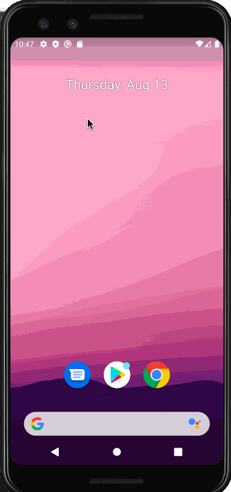

# Project 1 - *Simple To-Do*

**Simple To-Do** is an android app that allows building a todo list and basic todo items management functionality including adding new items, editing and deleting an existing item.

Submitted by: **Eugenia Zhang**

Time spent: **4** hours spent in total

## User Stories

The following **required** functionality is completed:

* [X] User can **view a list of todo items**
* [X] User can **successfully add and remove items** from the todo list
* [X] User's **list of items persisted** upon modification and and retrieved properly on app restart

The following **optional** features are implemented:

* [X] User can **tap a todo item in the list and bring up an edit screen for the todo item** and then have any changes to the text reflected in the todo list

The following **additional** features are implemented:

* [X] Included a How To Use page to help users who might not know how to use the app and includes a button that allows user to go back to the main page.
* [X] Changed app logo to one with a checkmark to denote a to-do app.
* [X] Changed color scheme to one that is more pleasing to the eye.

## Video Walkthrough

Here's a walkthrough of implemented user stories:

GIF created with [LiceCap](http://www.cockos.com/licecap/).

## Notes

Had one error that took me a while to figure out, but eventually realized that I had spelled a variable incorrectly.

## License

    Copyright 2020 Eugenia Zhang

    Licensed under the Apache License, Version 2.0 (the "License");
    you may not use this file except in compliance with the License.
    You may obtain a copy of the License at

        http://www.apache.org/licenses/LICENSE-2.0

    Unless required by applicable law or agreed to in writing, software
    distributed under the License is distributed on an "AS IS" BASIS,
    WITHOUT WARRANTIES OR CONDITIONS OF ANY KIND, either express or implied.
    See the License for the specific language governing permissions and
    limitations under the License.
